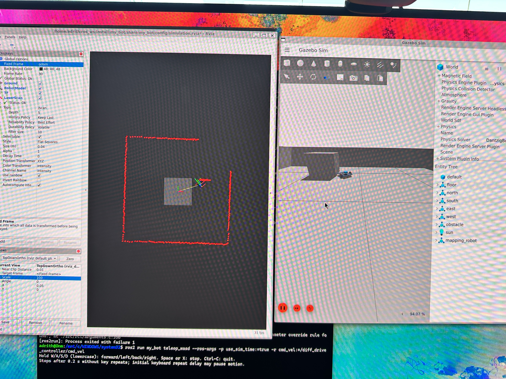

# Autonomous Indoor Mapping Robot

**A differential-drive robotics project connecting ESP32 wheel control with ROS 2, Gazebo, and LiDAR SLAM.**

Built around a custom 3D-printed chassis, this project combines encoder-feedback motor control, a versioned USB serial interface, and a ROS 2 simulation and hardware package. The target mission is to explore an unfamiliar indoor room and save a fresh 2D occupancy map.

**Status:** firmware and ROS source are implemented, and initial simulation driving and laser visualization have been demonstrated. Physical integration and autonomous mapping validation are **TBD**. See the [capability status](ROADMAP.md) for the remaining work.

## Demo and room maps

| Showcase | Result |
|---|---|
| Finished robot photograph | **TBD** |
| End-to-end autonomous mapping video | **TBD** |
| Room 1 — room photo, occupancy map, run record | **TBD** |
| Room 2 — room photo, occupancy map, run record | **TBD** |
| Room 3 — room photo, occupancy map, run record | **TBD** |
| Mapping duration, mapped area, repeatability | **TBD** |

[Media upload guide](media/README.md) · [Room map slots](maps/README.md) · [Final presentation checklist](docs/project-completion.md)

<details>
<summary>Existing demonstration: Gazebo simulation and laser visualization</summary>



Builder-observed on September 7, 2026: WASD driving, simulated scans reported at 10 Hz, and laser visualization in RViz. This image shows an initial simulation run; the completed room-map showcase above is awaiting results. [Evidence and limitations](results/2026-09-07-initial-simulation.md).

</details>

## Engineering highlights

- **Embedded control:** shared 50 Hz wheel controllers with feed-forward/PI feedback, bounded outputs, command ramps, and encoder telemetry.
- **Custom ROS hardware interface:** a C++ `ros2_control` plugin sends wheel velocities over a checksummed, sequenced serial protocol and converts encoder feedback into ROS wheel state.
- **Fault handling:** the ESP32 implements a 250 ms command watchdog; the host transport checks telemetry and acknowledgements, with explicit stop and reconnect handling.
- **Simulation and mapping:** a Xacro robot model, Gazebo Harmonic obstacle room, stamped WASD teleoperation, simulated LiDAR, and a separate SLAM Toolbox launch with manual map export.
- **Verification:** controller and protocol tests, pseudo-terminal serial fault tests, model/configuration tests, and dated physical and simulation observations.

The custom implementation is the firmware, serial transport/hardware plugin, and robot-specific integration. ROS 2 controllers, Gazebo, and SLAM Toolbox provide the standard control and mapping infrastructure. The robot description began with [Josh Newans’ my_bot template](https://github.com/joshnewans/my_bot); its [Apache-2.0 license](ros_ws/src/my_bot/LICENSE.md) is retained.

## Architecture

```text
ROS computer / simulation host                   ESP32 / physical drivetrain

WASD -> diff_drive_controller -> Esp32System ---- USB serial v2 ----> wheel PI -> motors
             |                      ^                                  ^
             |                      +----------- encoder state --------+ encoders
             v
       wheel odometry ----+
                          +--> SLAM Toolbox --> /map --> manual map export
LiDAR / simulated /scan --+

Simulation replaces Esp32System and the physical drivetrain with Gazebo.
Autonomous exploration, Nav2 execution, and automatic map saving: planned.
```

The ESP32 owns time-sensitive motor control and the local watchdog. The ROS computer owns the robot model, controllers, odometry, and mapping. Hardware selection is explicit; ROS bringup defaults to simulation. [Architecture and ownership](ARCHITECTURE.md) · [Serial protocol, units, and frames](docs/interfaces.md).

## Run the simulation

On **Ubuntu 24.04 with ROS 2 Jazzy and Gazebo Harmonic**, including WSL2 with working graphics:

```bash
cd ~
git clone https://github.com/adrithk/autonomous-mapping-robot.git
cd autonomous-mapping-robot/ros_ws
source /opt/ros/jazzy/setup.bash
# Initialize rosdep once if this machine has not used it before.
[ -f /etc/ros/rosdep/sources.list.d/20-default.list ] || sudo rosdep init
rosdep update
rosdep install --from-paths src --ignore-src -r -y --rosdistro jazzy
colcon build --packages-select my_bot --symlink-install
source install/setup.bash
colcon test --packages-select my_bot
colcon test-result --verbose
ros2 launch my_bot slam_sim.launch.py
```

In another terminal, source ROS and this workspace’s `install/setup.bash`, then:

```bash
ros2 run my_bot teleop_wasd --ros-args -p use_sim_time:=true \
  -p speed:=0.1 -p turn:=0.5 -r cmd_vel:=/diff_drive_controller/cmd_vel
```

Use `w/a/s/d` to drive and `space` or `x` to stop. Use `bringup.launch.py` for ordinary simulation without SLAM. [Full WSL setup](ros_ws/src/my_bot/WSL_SETUP.md) · [Create and save a map](ros_ws/src/my_bot/SLAM.md).

## Firmware and hardware

From the repository root with PlatformIO installed:

```bash
pio run -e keyboard
pio run -e ros_serial
```

Choose the environment explicitly before uploading. The committed default is `keyboard`; explicit commands also work when a local checkout selects another default. Hardware bringup and calibration are documented in the [ROS hardware guide](ros_ws/src/my_bot/HARDWARE.md) and [parts list](hardware/parts-list.md). The software watchdog is not an independently validated emergency stop; follow the [bench procedure](docs/testing.md) before driving the physical robot.

## Repository guide

| Path | Contents |
|---|---|
| `src/`, `include/`, `test/`, `platformio.ini` | ESP32 firmware and native tests |
| `ros_ws/src/my_bot/` | Complete ROS package: robot model, hardware plugin, simulation, SLAM, launch/config, tests |
| `hardware/` | Parts, calibration inputs, CAD and wiring upload slots |
| `media/`, `maps/` | Demo/photo placeholders and room-map evidence slots |
| `results/` | Dated verification records |
| `docs/` | Interfaces, testing, decisions, preserved execution plans, completion checklist |

[Documentation index](docs/README.md) · [Contributor entry point](START_HERE.md) · [Roadmap](ROADMAP.md)
