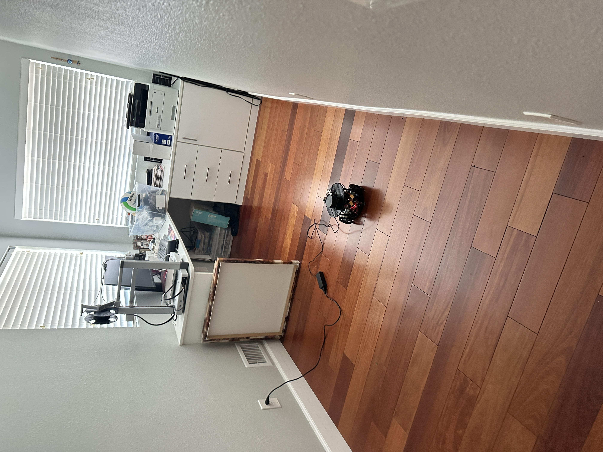
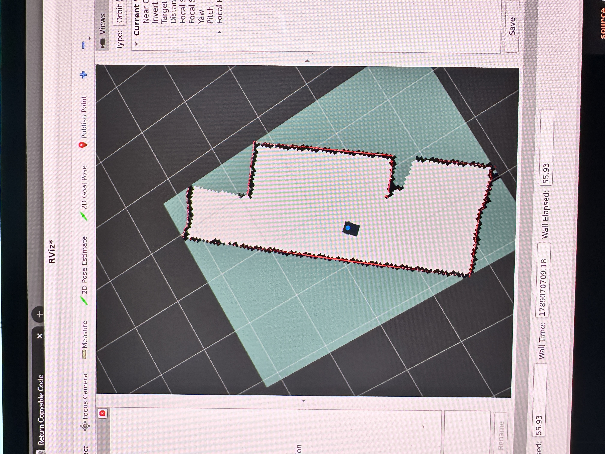
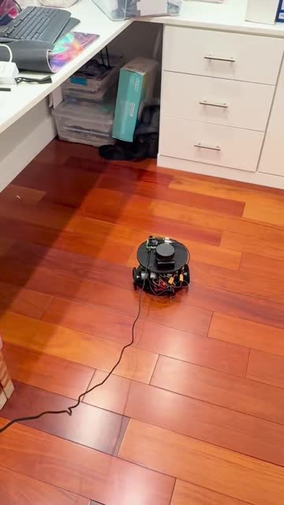
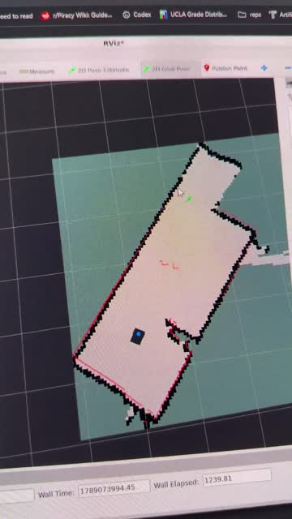
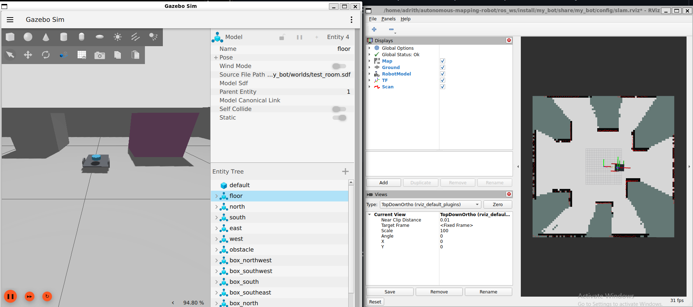

# Autonomous Indoor Mapping Robot

**ROS 2 • SLAM Toolbox • Nav2 • ros2_control • Gazebo • ESP32**

A custom differential-drive robot designed to explore an unfamiliar indoor space and produce a fresh 2D occupancy map. The project connects embedded wheel-speed control with a ROS 2 perception and motion stack on a Raspberry Pi, built around a 3D-printed chassis and a 360-degree LiDAR.

The final system design pairs **SLAM Toolbox** for mapping with **Nav2** for autonomous movement while the map is being built. An exploration component selects reachable viewpoints in known free space beside unmapped regions; Nav2 plans and executes motion to those destinations, while the ESP32 controls the motors using encoder feedback.

## Engineering highlights

- **ROS 2 integration:** a Jazzy package brings together the URDF/Xacro robot model, launch files, controller configuration, wheel odometry, TF, simulated LiDAR, and mapping.
- **SLAM Toolbox:** laser scans and wheel odometry build an occupancy map, with `map → odom → base_link → laser` transforms and map export support. Demonstrations include simulated mapping and teleoperated mapping of a real room.
- **Nav2 navigation:** the physical demonstration uses a saved map and AMCL localization, with Nav2 planning and driving to operator-selected destinations. Frontier exploration and automatic saving are implemented for simulation; autonomous exploration runtime acceptance remains pending.
- **Custom ros2_control hardware interface:** a C++ `SystemInterface` connects the standard differential-drive controller to the ESP32 through a versioned USB serial protocol, exchanging wheel velocity commands and encoder state.
- **Embedded motor control:** shared 50 Hz feed-forward/PI wheel controllers, encoder sampling, target ramps, bounded motor outputs, and a 250 ms serial-command watchdog.
- **Gazebo simulation:** a robot model and obstacle-room world provide a development environment for teleoperation, laser visualization, controller integration, and SLAM before physical integration.

## Demo

### Real-room mapping through teleoperation

The robot was driven manually through the room while its RPLIDAR A1M8 and encoder-based odometry supplied SLAM Toolbox with observations. RViz displayed the resulting occupancy map, which was saved for the navigation demonstration.

| Physical robot in the room | SLAM map displayed in RViz |
|:---:|:---:|
|  |  |

The map shows observed free space in light gray, occupied boundaries in black, and unknown space in gray-green. Red points show LiDAR returns. These photographs document **manual driving with automatic map building**.

### Nav2 navigation on the saved map

After mapping, the saved room map was loaded with **AMCL localization**. The operator selects a destination in RViz; **Nav2 computes a path and controls the robot's movement toward it**. These recordings show the physical robot and the RViz view of its changing position on the map.

| Robot moving through the room · 49 s | RViz navigation view · 51 s |
|:---:|:---:|
| [](media/real-room/nav2-robot.mp4) | [](media/real-room/nav2-rviz.mp4) |
| [Watch / download MP4](media/real-room/nav2-robot.mp4) | [Watch / download MP4](media/real-room/nav2-rviz.mp4) |

Click a preview to open the recording; use **View raw / Download** if GitHub does not offer playback. Both clips retain their full duration and playback speed.

This is **goal-directed autonomous navigation**: the human chooses where to go, and Nav2 handles planning and driving. Automatic frontier selection for exploring an entire unfamiliar room is the next mission-level validation step. The physical run uses tethered power; these clips do not establish complete coverage or repeated navigation reliability.

[September 10, 2026 demonstration record and remaining validation](results/2026-09-10-real-room-mapping-navigation.md).

## ROS 2 mapping and autonomous movement

The ROS computer handles the robot model, transforms, sensor processing, mapping, and high-level motion. `diff_drive_controller` converts body-velocity commands into wheel targets and publishes encoder-based odometry. `robot_state_publisher` supplies the robot's link transforms, and SLAM Toolbox combines the laser observations with the motion estimate to maintain the map.

In the final autonomous mapping workflow, frontier exploration selects reachable unexplored regions from the live map. **Nav2 provides the path planning and motion control to reach those regions while SLAM Toolbox continues mapping.** This separates deciding where to explore from executing the movement. The target mission remains fresh-room mapping. Saved-map navigation is an intermediate physical demonstration: AMCL localizes against the saved map, and Nav2 drives to selected goals without rebuilding that map. SLAM and AMCL are separate operating modes.

```text
Final autonomous mapping design

Live map → Frontier exploration → Nav2 → diff_drive_controller
                                            │
                                     ros2_control interface
                                            │ USB serial
                                            ▼
                                  ESP32 wheel PI → Motors
                                            ▲
                                         Encoders

LiDAR scans + Wheel odometry → SLAM Toolbox → Occupancy map
```

The serial hardware interface checks acknowledgements and telemetry freshness, while the ESP32 enforces its own command timeout independently of ROS. Simulation replaces the physical wheel interface with Gazebo's `gz_ros2_control` backend.

**Implementation status:** firmware, the ROS hardware interface, simulation, SLAM, Nav2, and the simulation explorer with automatic map saving are included. Initial physical teleoperation, LiDAR mapping and saved-map Nav2 navigation are documented in the demonstration above and the dated results. Repeated mission trials, measured physical safety/odometry checks and autonomous exploration acceptance remain pending. [Detailed status](ROADMAP.md).

## Simulation code

### Initial simulated LiDAR SLAM



**Left:** Gazebo shows the simulated robot and obstacles. **Right:** RViz displays the initial 2D occupancy map built with SLAM Toolbox from simulated LiDAR scans. Gray-green regions are unknown/unmapped, light gray regions are observed free space, and black cells mark detected occupied surfaces such as walls and obstacles. Red points overlay the current LiDAR returns. Areas hidden behind obstacles remain unmapped until observed from another viewpoint.

[Initial implementation screenshot, supplied September 8, 2026](results/2026-09-08-simulated-lidar-slam.md).

The [ROS package](ros_ws/src/my_bot/) contains the simulation and robot-specific integration developed for this project. Gazebo Harmonic models the differential-drive chassis in a room with six interior obstacles. Simulated wheel feedback feeds the ROS controllers, and a simulated LiDAR supplies scans for RViz visualization and SLAM Toolbox.

The model uses shared geometry, separate simulation and hardware configurations, and an explicit choice of control backend. The simulation includes estimated masses, inertias, and contact properties; it supports software integration work while physical calibration is completed. A separate mapping launch adds SLAM Toolbox and occupancy-map visualization to the simulation.

[Robot model](ros_ws/src/my_bot/description/) · [Launch files](ros_ws/src/my_bot/launch/) · [ROS configuration](ros_ws/src/my_bot/config/) · [Simulation world](ros_ws/src/my_bot/worlds/test_room.sdf)

## Hardware and embedded software

The drivetrain combines two encoder gearmotors, BTS7960 motor drivers, an ESP32, and a custom printed chassis. The ROS platform is designed around a Raspberry Pi 5 and RPLIDAR A1M8. The ESP32 owns encoder acquisition, wheel feedback control, motor outputs, and immediate command-loss handling; the Pi owns the ROS stack.

The firmware has separate keyboard and ROS-serial entry points backed by the same wheel-control implementation. The serial protocol includes checksums, sequence tracking, wheel commands, and state telemetry. Native tests cover controller behavior, parser boundaries, encoder rollover, and host/firmware compatibility.

[Firmware](src/) · [ROS hardware interface](ros_ws/src/my_bot/src/) · [Parts and geometry](hardware/parts-list.md) · [Protocol and interfaces](docs/interfaces.md)

## Development and verification

The project was developed through drivetrain bringup, encoder-feedback control, a ROS serial interface, and simulation-based ROS/SLAM integration. Verification includes firmware builds, native controller/protocol tests, emulated serial fault tests, robot-model/configuration checks, and dated bench and simulation observations. Physical integration and autonomous mission acceptance are tracked separately from software tests.

[Architecture](ARCHITECTURE.md) · [Recorded results](results/) · [ROS audit](ros_ws/src/my_bot/docs/results/2026-09-07-code-audit.md) · [Development roadmap](ROADMAP.md)

## Credits

Custom work includes the ESP32 firmware, serial transport and ROS hardware plugin, and robot-specific model, simulation, and mapping integration. The robot description began with [Josh Newans’ my_bot template](https://github.com/joshnewans/my_bot), whose [Apache-2.0 license](ros_ws/src/my_bot/LICENSE.md) is retained. ROS 2, ros2_control, Gazebo, SLAM Toolbox, and Nav2 provide the underlying robotics frameworks.
