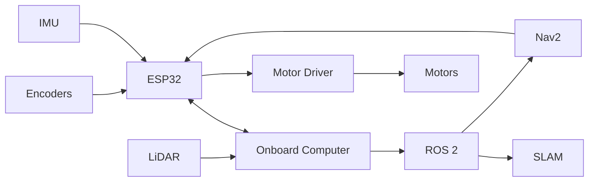

# Autonomous Differential-Drive SLAM Robot

This project is a custom differential-drive mobile robot being developed from the ground up, beginning with reliable motor control and encoder odometry and progressing toward ROS 2-based SLAM, localization, navigation, and autonomous exploration.

**Current status:** Mechanical design and differential-drive hardware integration. This repository is a project scaffold; firmware, sensor drivers, ROS 2 nodes, and autonomous behaviors have not yet been implemented or validated.

## Project overview

The planned platform pairs an ESP32 with an onboard computer. The ESP32 will handle timing-sensitive motor, encoder, and IMU work, while an Ubuntu 24.04 computer will run ROS 2 Jazzy, LiDAR processing, SLAM Toolbox, and Nav2. This split keeps low-level motion control independent from higher-level mapping and planning.

The immediate engineering goal is to confirm the mechanical layout, electrical interfaces, component limits, and drivetrain measurements. Those inputs are required before pin assignments, control loops, odometry parameters, or robot geometry can be implemented credibly.

## System architecture

The following diagram represents the intended data and control flow. Interfaces may change as hardware is selected and tested.

## Planned capabilities

These capabilities are roadmap targets, not completed features:

- Differential-drive motor control
- Wheel encoder odometry
- IMU integration
- LiDAR sensing
- ROS 2 communication
- SLAM and map creation
- Localization in saved maps
- Autonomous navigation
- Obstacle avoidance
- Autonomous exploration and return-to-start behavior
- Possible future docking support

## Repository structure

- `firmware/esp32/` contains the PlatformIO project and interfaces reserved for low-level control.
- `ros2_ws/` contains scaffolding for description, bringup, SLAM, and navigation packages.
- `hardware/` records the bill of materials and reserves space for CAD, schematics, and datasheets.
- `docs/` captures the proposed architecture, hardware decisions, wiring safety, setup, and test sequence.
- `scripts/` provides non-operational entry points for future setup, build, run, and flash workflows.
- `tests/`, `data/`, and `media/` reserve organized locations for evidence produced during development.

## Development roadmap

1. **Phase 1 — Mobile Base:** Assemble the chassis, motors, wheels, caster, electronics mounts, and safe power distribution.
2. **Phase 2 — Motor Control:** Implement independent motor control, differential-drive motion, and emergency-stop behavior.
3. **Phase 3 — Odometry:** Read encoders, estimate wheel velocity, integrate the IMU, and calibrate the drivetrain.
4. **Phase 4 — ROS 2 Integration:** Connect the onboard computer, define the robot model, publish sensor topics, and establish TF frames.
5. **Phase 5 — SLAM:** Integrate LiDAR, visualize in RViz, map with SLAM Toolbox, and record ROS bags.
6. **Phase 6 — Navigation:** Configure localization and Nav2 for goal-based navigation and obstacle avoidance.
7. **Phase 7 — Autonomous Behaviors:** Add exploration, return-to-start logic, recovery behaviors, and evaluate docking.

Progress should be recorded only after bench tests and integration evidence exist. Configuration values currently marked `TODO`, `TBD`, or otherwise invalid must not be used on hardware.

## Technology stack

- C++ with the Arduino framework and PlatformIO for ESP32 firmware
- Python and C++ for planned ROS 2 nodes
- Ubuntu 24.04 and ROS 2 Jazzy
- SLAM Toolbox, Nav2, and RViz
- Fusion 360 for mechanical design
- Git and GitHub for version control and review

## Documentation

Start with the [proposed architecture](docs/architecture.md), then review the [hardware record](docs/hardware.md) and [wiring safety notes](docs/wiring.md). The [setup checklist](docs/setup.md) describes the intended development environment, while the [testing plan](docs/testing.md) defines a safe subsystem-by-subsystem validation order.

Package-specific intent is documented beside each ESP32 and ROS 2 scaffold. Hardware selections belong in [`hardware/bom.csv`](hardware/bom.csv), with supporting CAD, schematics, and datasheets added only when available.

## License

This project is available under the [MIT License](LICENSE).
